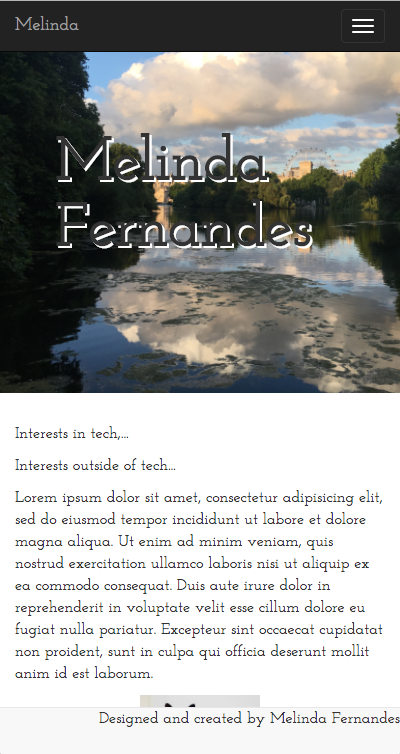

### Table of contents
- [Objectives](#Objectives)
- [My Website](#My-Website)
- [The Journey](#The-Journey)
- [Wireframe](#Wireframe)
- [Designing the Website](#Designing-the-Website)
- [Building the HTML Template](#Building-the-HTML-Template)
- [Bootstrap and CSS](#Bootstrap-and-CSS)

## Objectives

Tasked to create a personal website, using HTML, CSS and Bootstrap, my intentions were to create a simple and clean website.
I had made several previous attempts to code own website to be an online portfolio, yet I couldn't follow through on it, so I was excited to tackle this mini-project.

#### The checklist:
- Wireframe
- Github repo -10 commits
- Color scheme <-- coolors
- Install Bootstrap
- Link custom stylecheet
- Build HTML Template
- Bootstrapping CSS

## My Website
### The Web Version
 
 
 
 
 
### The Mobile Version
 
 
  
 

## The Journey

Learning HTML and CSS two days prior, felt like a breeze to me, however I struggled to grasp the concept of the Bootstrap framework. At this point in any personal project, I would have given up. I spent some time reading further into it, realising the best approach would be to take it one step at a time.

## Wireframe
Designing my wireframe was straightforward, as I knew I didn't want too much content on the page. The main body of my page consisted of the Home, About, CV, and Contact sections. These would become my rows, following the bootstrap layout system. I would also have a nav bar at the top, and footer down below. For each section, I continued to decide which ones I would then split in to colums.

#### Web Wireframe
 
#### Mobile Wireframe
 


## Designing the Website
The best personal websites I had seen were simple, easy on the eyes, with a limited colour palette. Using Coolors.co, I arrived at this palette:

 

This inspired me to use on of my own images with a similar palette, to use as a background image and bring my page together.

I chose a sans-serif font called Josefin Slab, which I linked from the open source Google Fonts website. 

## Building the HTML template
Following what I had learnt, I began my webpage by building a simple HTML template based on my wireframe. The simple layout allowed me to easily divide the page into a regular HTML skeleton with a header, main, and footer. 

```
<!DOCTYPE html>
<html>
<head>
	<title>Melinda Fernandes</title>
	<link rel="stylesheet" href="bootstrap/css/bootstrap.min.css">
</head>
<body>
	<!-- navigation bar -->
	<header>
		<ul>
			<li>Home</li>
			<li>About</li>
			<li>CV</li>
			<li>Contact</li>
		</ul>
	</header>

	<main>
		<section class="topleft">
			<p>Interests in tech,...</p>
			<p>Interests outside of tech...</p>
		</section>
		<section class="topright">
			
		</section>

		<section class="bottomleft">
			<h1>CV</h1>
			<h3>Education</h3>
			<article>
				articles (with lists?)
			</article>
			<h3>Work Experience</h3>
			<article>
				articles (with lists?)
			</article>
		</section>
		<section class="bottomright">
			<h2>Technical Skills</h2>
			<ul>
				<li>Skill 1</li>
				<li>Skill 2</li>
				<li>Skill 3</li>
				<li>Skill 4</li>
			</ul>
		</section>

		<section class="contact">
			contact
			background image, text on right side
		</section>
	</main>

	<footer>
		<p>
			Designed and created by Melinda Fernandes
		</p>
	</footer>
	
</body>
</html>
```
## Bootstrap and CSS
The approach that worked best for me when including bootstrap in my code, was to take each section and group it into a div class container with a div class row. Should I want two divs on the same row, I would give each of those divs a col-md-6 class. The most sections I would split my rows into was by 2.
Other than the containers, rows, and columns, I used bootstrap for my navigation bar, the large jumbotron of the homescreen, and finally the footer. With my bootstrap layout controlling the flow of the page, I needed little CSS, to style the page, only adjusting the font sizes, colors, images, and padding.